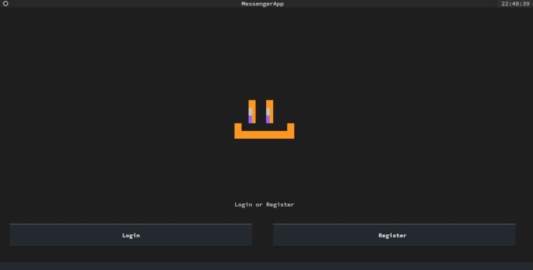
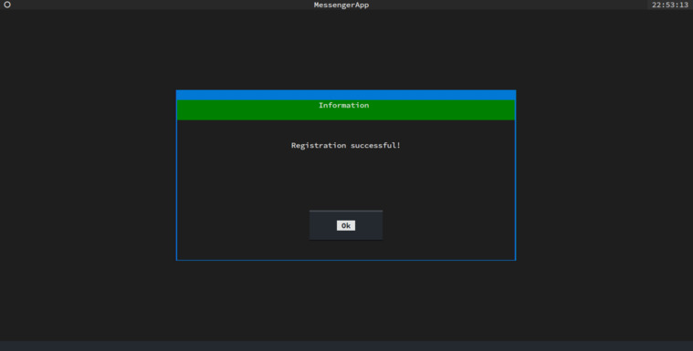
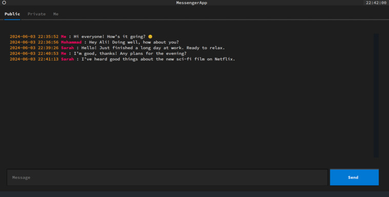
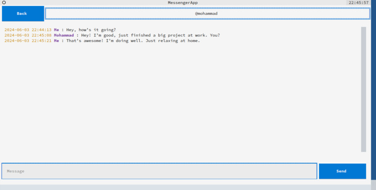
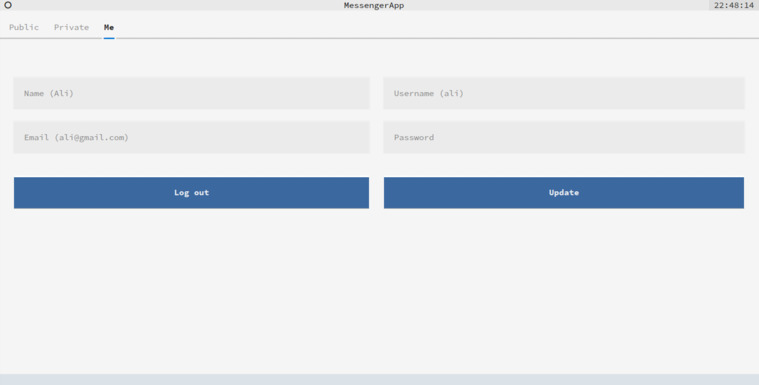
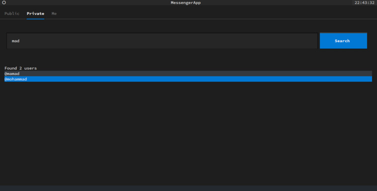

# TChat Messenger App

The TChat Messenger App is a Python-based application designed to showcase the integration of multiple technologies and tools required to build a real-time messaging platform. This application serves as an educational resource, providing developers with a practical example of how to implement various concepts essential to real-time communication systems.

## Important Note

This application is intended solely for educational purposes and **should not** be utilized in any production environment for actual messaging needs. It is not designed or optimized for production-level performance, security, or reliability.

## Prerequisites/What You'll Learn

* **Software Setup:**
    * **Python:** The core programming language for this application. Users should have an intermediate understanding of Python syntax, including functions (decorators and generators), object-oriented programming, modules, and both synchronous and asynchronous programming.
    * **Docker:** Containerization technology for easy deployment and management of the server environment.

* **Programming Paradigms:**
    * **Synchronous Programming:** Utilize synchronous code for tasks such as sending and retrieving messages.
    * **Asynchronous Programming:** Implement asynchronous programming patterns for real-time notification management.

* **Databases:**
    * **SQL Databases:** Understand and potentially utilize SQL (relational) databases like MySQL for structured data such as messages and user accounts. This application uses MySQL with the SQLAlchemy ORM.
    * **NoSQL Databases:** Employ NoSQL (non-relational) databases like Redis Pub/Sub for notification management.
* **Websockets:** Implement real-time communication through WebSockets to enable bidirectional communication between the server and client without constant page refreshes. This is particularly useful for notification management.
* **HTTP Methods:** Understand and utilize HTTP methods such as GET, POST, PUT, and DELETE for various functionalities like creating and updating accounts, and sending messages.

* **Web Server:**
    * **WSGI:** A standard for interfacing web servers with web applications. Flask, used in this project, is a WSGI-compliant framework. Gunicorn, a WSGI server, is used to serve the project in production.
    * **AWSGI:** The WSGI equivalent for the asynchronous part of the server, handling notification management, implemented by Sanic.
    * **Nginx:** A reverse proxy server that integrates both aforementioned servers on one port, provides additional security (SSL), and offers load balancing in production environments.

* **Terminal User Interface:** Create a terminal-based user-friendly interface using Textual, a powerful library for building rich TUIs in Python. Enhance the UI with libraries like Rich and Rich-Pixels.

* **Parallel Programming:** Leverage parallel programming techniques to handle multiple tasks concurrently, especially for receiving notifications and managing the TUI.

## Getting Started

* **Clone the Repository:** Clone this project's repository from your Git client.
    ```bash
    $ git clone https://github.com/alirezaafzalaghaei/tchat.git
    ```

* **Running the Server:**

    1. Ensure you have Docker installed on your system. For example, for Arch Linux, you can install Docker using the following command:
        ```bash
        $ sudo pacman -S docker-compose
        ```
    2. Change directory to `server`:
        ```bash
        $ cd server
        ```
    3. Run the server:
        ```bash
        $ docker-compose up -d
        ```

* **Running the Client:**

    1. Install and activate a Python virtual environment (version 3.12 or later). Lower Python versions are not tested but should work.
        ```bash
        $ conda create -n tchatenv python=3.12
        $ conda activate tchatenv
        ```
    2. Change directory to `client`:
        ```bash
        $ pip install .
        ```
    3. Run the client with the default session:
        ```bash
        $ tchat
        ```
    4. Or run with a custom session file:
        ```bash
        $ tchat --session user-guest.json
        ```

## Screenshots

<table>
  <tr>
    <td>
      
    </td>
    <td>
      
    </td>
  </tr>
  <tr>
    <td>
      
    </td>
    <td>
      
    </td>
  </tr>
  <tr>
    <td>
      
    </td>
    <td>
      
    </td>
  </tr>
</table>

## Further Exploration

Detailed documentation and details about each application and its implementation are provided in the Read Me files located in each directory and subdirectory.

## Contributions

We encourage contributions to this project through issue reporting and pull requests. If you encounter bugs or have ideas for improvements, please report them. To submit code changes, fork the repository, make your modifications in a new branch, and then open a pull request.


